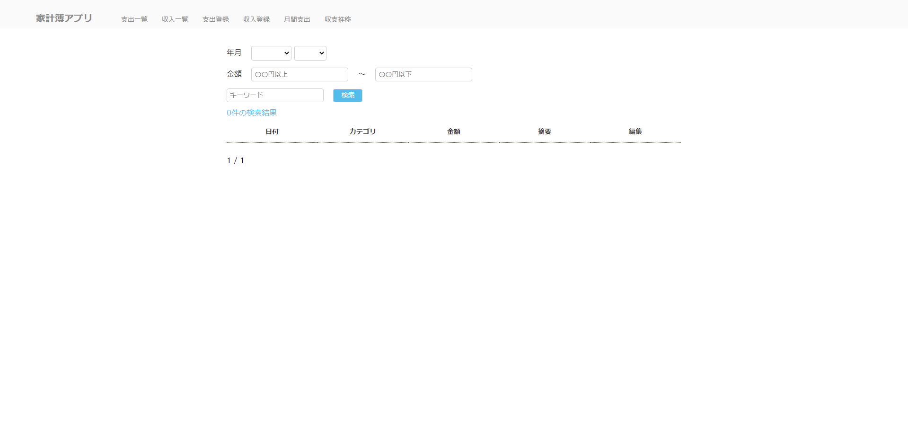

# 家計簿 web app 


## はじめに
シークレットを含んだファイル(★add/★fix)の追加・修正を行い deploy する流れ  
cat リダイレクトでファイル作成例としているが、エディタでの作成を推奨  
```
.
├── README.md
├── docker
│   ├── .env ★add
│   ├── Dockerfile
│   ├── docker-compose.yaml
│   └── requirements.txt
├── kakeibo
│   ├── __init__.py
│   ├── __pycache__
│   ├── admin.py
│   ├── apps.py
│   ├── forms.py
│   ├── migrations
│   │   ├── 0001_initial.py
│   │   ├── __init__.py
│   │   └── __pycache__
│   ├── models.py
│   ├── my_context_processor.py
│   ├── plugin_plotly.py
│   ├── seaborn_colorpalette.py
│   ├── static
│   │   └── kakeibo
│   │       └── css
│   │           ├── reset.css
│   │           └── style.css
│   ├── templates
│   │   └── kakeibo
│   │       ├── base.html
│   │       ├── delete.html
│   │       ├── income_list.html
│   │       ├── month_dashboard.html
│   │       ├── payment_list.html
│   │       ├── register.html
│   │       ├── transition.html
│   │       └── widgets
│   │           ├── custom_radio.html
│   │           └── custom_radio_option.html
│   ├── templatetags
│   │   ├── __pycache__
│   │   └── kakeibo.py
│   ├── tests.py
│   ├── urls.py
│   ├── views.py
│   └── widgets.py
├── kubernetes
│   ├── base
│   │   ├── deployment-backend-db01.yaml
│   │   ├── deployment-frontend-app01.yaml
│   │   └── kustomization.yaml
│   └── overlay
│       ├── dev
│       │   ├── configmap-django-variable01.yaml
│       │   ├── docker-registry.json ★add※
│       │   ├── kustomization.yaml ★fix
│       │   ├── namespace.yaml
│       │   ├── password.txt ★add
│       │   ├── transformer-labels.yaml
│       │   └── transformer-suffixprefix.yaml
│       └── prod
│           ├── configmap-django-variable01.yaml
│           ├── docker-registry.json ★add※
│           ├── kustomization.yaml ★fix
│           ├── namespace.yaml
│           ├── password.txt ★add
│           ├── transformer-labels.yaml
│           └── transformer-suffixprefix.yaml
├── manage.py
├── project
│   ├── __init__.py
│   ├── __pycache__
│   ├── settings.py
│   ├── urls.py
│   └── wsgi.py
└── register
    ├── __init__.py
    ├── __pycache__
    ├── admin.py
    ├── apps.py
    ├── migrations
    │   ├── 0001_initial.py
    │   ├── __init__.py
    │   └── __pycache__
    ├── models.py
    ├── tests.py
    └── views.py
```

## docker-compose の場合
```
cd docker
```
```
cat <<EOF> .env
POSTGRES_NAME=postgres
POSTGRES_DB=postgres
POSTGRES_USER=postgres
POSTGRES_PASSWORD=password
EOF
```
```
docker-compsoe build --no-cache
```
```
docker-compose up -d
```

## kubernetes の場合
```
cd kuberentes/kakeibo/kubernetes/overlay/dev/
```
### kustomize.yaml setup
```bash
cat <<EOF> password.txt
password
EOF
```

### kustomization.yaml の patchesStrategicMerge を修正して storageclass,resources の調整
```
patchesStrategicMerge:
- |-
  apiVersion: v1
  kind: PersistentVolumeClaim
  metadata:
    name: frontend-grafana-app01
  spec:
    accessModes:
      - ReadWriteMany
    resources:
      requests:
        storage: 調整
    storageClassName: 調整
```

### deploy

```
kubectl apply -f namespace.yaml
```
```
kubectl apply -k ./
```


## 備考
### docker-registry setup
django のイメージはビルド済みを用意していますが、個人で用意したい場合はプライベートレジストリのシークレットをローカルに作成し,  
kustomization.yaml にある docker-registry のコメントアウトを解除してください。
docker-registry のフォーマットは、"auth"Key の value は <ユーザー名:パスワード> を base64 でエンコードしたものです。

```
{"auths":{"registry.gitlab.com":{"username":"<ユーザ名>","password":"<パスワード>","auth":"<$(echo -n 'ユーザ名:パスワード' | base64)>"}}}
```

例)
```
echo -n 'user:pass' | base64
dXNlcjpwYXNz
```
```
{"auths":{"registry.gitlab.com":{"username":"user","password":"pass","auth":"dXNlcjpwYXNz"}}}
```

docker-registry.json作成

```
cat <<'EOF'> docker-registry.json
{"auths":{"registry.gitlab.com":{"username":"user","password":"pass","auth":"dXNlcjpwYXNz"}}}
EOF
```