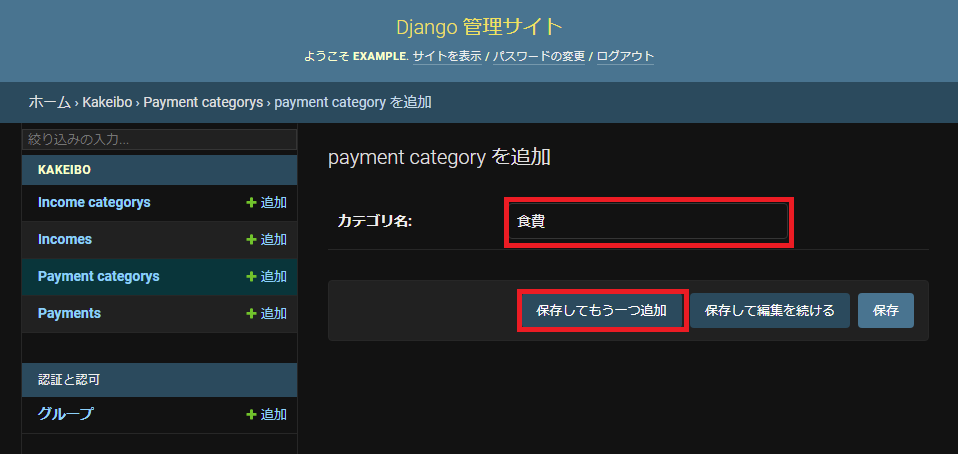
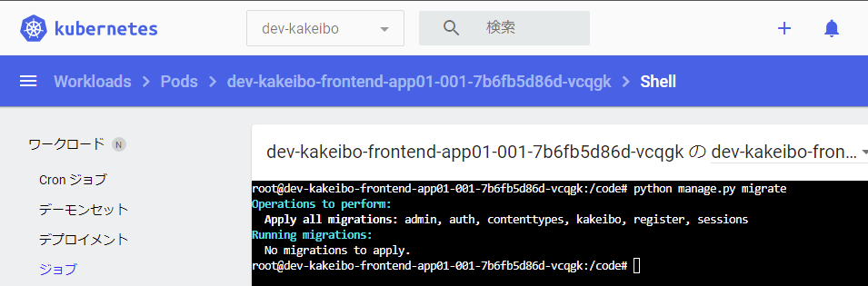

# Status
[](https://github.com/AbeYuki/kakeibo/?branch=testing)

# 家計簿 web app 


## はじめに
シークレットを含んだファイル(★add/★fix)の追加・修正を行い deploy する流れ  
cat リダイレクトでファイル作成例としているが、エディタでの作成を推奨  
```
.
├── README.md
├── docker
│   ├── Dockerfile
│   ├── docker-compose.yaml
│   ├── local_settings.sh
│   └── requirements.txt
├── kakeibo
│   ├── __init__.py
│   ├── __pycache__
│   │   ├── __init__.cpython-310.pyc
│   │   ├── __init__.cpython-38.pyc
│   │   ├── admin.cpython-310.pyc
│   │   ├── admin.cpython-38.pyc
│   │   ├── apps.cpython-310.pyc
│   │   ├── apps.cpython-38.pyc
│   │   ├── forms.cpython-310.pyc
│   │   ├── forms.cpython-38.pyc
│   │   ├── models.cpython-310.pyc
│   │   ├── models.cpython-38.pyc
│   │   ├── plugin_plotly.cpython-310.pyc
│   │   ├── plugin_plotly.cpython-38.pyc
│   │   ├── seaborn_colorpalette.cpython-310.pyc
│   │   ├── seaborn_colorpalette.cpython-38.pyc
│   │   ├── urls.cpython-310.pyc
│   │   ├── urls.cpython-38.pyc
│   │   ├── views.cpython-310.pyc
│   │   ├── views.cpython-38.pyc
│   │   ├── widgets.cpython-310.pyc
│   │   └── widgets.cpython-38.pyc
│   ├── admin.py
│   ├── apps.py
│   ├── forms.py
│   ├── migrations
│   │   ├── 0001_initial.py
│   │   ├── __init__.py
│   │   └── __pycache__
│   │       ├── 0001_initial.cpython-310.pyc
│   │       ├── 0001_initial.cpython-38.pyc
│   │       ├── __init__.cpython-310.pyc
│   │       └── __init__.cpython-38.pyc
│   ├── models.py
│   ├── my_context_processor.py
│   ├── plugin_plotly.py
│   ├── seaborn_colorpalette.py
│   ├── static
│   │   └── kakeibo
│   │       └── css
│   │           ├── reset.css
│   │           └── style.css
│   ├── templates
│   │   └── kakeibo
│   │       ├── base.html
│   │       ├── delete.html
│   │       ├── income_list.html
│   │       ├── month_dashboard.html
│   │       ├── payment_list.html
│   │       ├── register.html
│   │       ├── transition.html
│   │       └── widgets
│   │           ├── custom_radio.html
│   │           └── custom_radio_option.html
│   ├── templatetags
│   │   ├── __pycache__
│   │   │   ├── kakeibo.cpython-310.pyc
│   │   │   └── kakeibo.cpython-38.pyc
│   │   └── kakeibo.py
│   ├── tests.py
│   ├── urls.py
│   ├── views.py
│   └── widgets.py
├── kubernetes
│   ├── base
│   │   ├── deployment-backend-db01.yaml
│   │   ├── deployment-frontend-app01.yaml
│   │   └── kustomization.yaml
│   └── overlay
│       ├── dev
│       │   ├── configmap-django-variable01.yaml
│       │   ├── docker-registry.json
│       │   ├── kustomization.yaml
│       │   ├── namespace.yaml
│       │   ├── password.txt
│       │   ├── transformer-labels.yaml
│       │   └── transformer-suffixprefix.yaml
│       └── prod
│           ├── configmap-django-variable01.yaml
│           ├── docker-registry.json
│           ├── kustomization.yaml
│           ├── namespace.yaml
│           ├── password.txt
│           ├── secret
│           │   ├── docker-registry.json
│           │   ├── kustomization.yaml
│           │   └── password.txt
│           ├── transformer-labels.yaml
│           └── transformer-suffixprefix.yaml
├── manage.py
├── project
│   ├── __init__.py
│   ├── __pycache__
│   │   ├── __init__.cpython-310.pyc
│   │   ├── __init__.cpython-38.pyc
│   │   ├── settings.cpython-310.pyc
│   │   ├── settings.cpython-38.pyc
│   │   ├── settings_local.cpython-310.pyc
│   │   ├── settings_local.cpython-38.pyc
│   │   ├── urls.cpython-310.pyc
│   │   ├── urls.cpython-38.pyc
│   │   └── wsgi.cpython-310.pyc
│   ├── asgi.py
│   ├── settings.py
│   ├── settings_local.py
│   ├── urls.py
│   └── wsgi.py
└── register
    ├── __init__.py
    ├── __pycache__
    │   ├── __init__.cpython-310.pyc
    │   ├── __init__.cpython-38.pyc
    │   ├── admin.cpython-310.pyc
    │   ├── admin.cpython-38.pyc
    │   ├── apps.cpython-310.pyc
    │   ├── apps.cpython-38.pyc
    │   ├── models.cpython-310.pyc
    │   └── models.cpython-38.pyc
    ├── admin.py
    ├── apps.py
    ├── migrations
    │   ├── 0001_initial.py
    │   ├── __init__.py
    │   └── __pycache__
    │       ├── 0001_initial.cpython-310.pyc
    │       ├── 0001_initial.cpython-38.pyc
    │       ├── __init__.cpython-310.pyc
    │       └── __init__.cpython-38.pyc
    ├── models.py
    ├── tests.py
    └── views.py```
```

<br>  
<br>  
<br>  

## docker-compose の場合
```
cd docker
```
```
cat <<EOF> .env
POSTGRES_NAME=postgres
POSTGRES_DB=postgres
POSTGRES_USER=postgres
POSTGRES_PASSWORD=password
EOF
```
```
docker-compsoe build --no-cache
```
```
docker-compose up -d
```

<br>  
<br>  
<br>  

## kubernetes の場合
```
cd kubernetes/overlay/dev/
```
### kustomize.yaml setup
```bash
echo -n 'password' secret/password.txt
```

### kustomization.yaml の patchesStrategicMerge を修正して storageclass,resources の調整
```
patchesStrategicMerge:
- |-
  apiVersion: v1
  kind: PersistentVolumeClaim
  metadata:
    name: frontend-grafana-app01
  spec:
    accessModes:
      - ReadWriteMany
    resources:
      requests:
        storage: 調整
    storageClassName: 調整
```

<br>  
<br>  
<br>  

### deploy
namespace deploy  
```
kubectl apply -f namespace.yaml
```
secret deploy  
※Gitops を考慮して secret を分離  
```
kubectl apply -k secret/
```
各オブジェクト deploy
```
kubectl apply -k ./
```

<br>  
<br>  
<br>  


## 備考
### docker-registry setup
django のイメージはビルド済みを用意していますが、個人で用意したい場合はプライベートレジストリのシークレットをローカルに作成し,  
kustomization.yaml にある docker-registry のコメントアウトを解除してください。
docker-registry のフォーマットは、"auth"Key の value は <ユーザー名:パスワード> を base64 でエンコードしたものです。

```json
{"auths":{"registry.gitlab.com":{"username":"<ユーザ名>","password":"<パスワード>","auth":"<$(echo -n 'ユーザ名:パスワード' | base64)>"}}}
```

例)
```bash
echo -n 'user:pass' | base64
dXNlcjpwYXNz
```
```json
{"auths":{"registry.gitlab.com":{"username":"user","password":"pass","auth":"dXNlcjpwYXNz"}}}
```

docker-registry.json作成

```bash
cat <<'EOF'> secret/docker-registry.json
{"auths":{"registry.gitlab.com":{"username":"user","password":"pass","auth":"dXNlcjpwYXNz"}}}
EOF
```

<br>
<br>
<br>

## 使い方
### 1. コンテナ内で以下コマンドを実行し、スーパーユーザを作成  
```bash
python manage.py createsuperuser
```
  
  

<br>

### 2. 管理サイトへログイン(/admin)  
  

<br>

### 3. 管理サイトの Payment categorys (支出)から支出のカテゴリーを作成  
  

<br>

  

<br>

  

<br>

  
  
Income categorys (収入)も同様にカテゴリーを作成    

<br>

### 4. コンテナから migrate 実行  
```
python manage.py migrate
```


<br>


### 5. 家計簿アプリから支出登録


<br>


<br>

